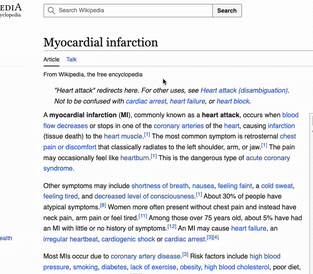

# Perplexity Med Sidebar

A Chrome and Edge extension for medical professionals. Select terms on any website and get expert-level explanations with **sourced references**, powered by the Perplexity API.

---

## 🩺 What it does

- 💬 Explains medical terms with a precise, expert-level Perplexity AI response
- 🔗 Answers include up-to-date web references (with citation markers)
- 🧠 Chat continues in a compact overlay window with full history
- 🔄 Suggests dynamic, relevant follow-up questions (auto-generated)
- 🖥️ Clean interface, modeled after ChatGPT, optimized for clinical use

---

## 💻 Features

- Professional-level answers with citation links (when available)
- Medical-context prompts
- Smart follow-up buttons
- Aligned user/assistant bubbles
- Local API key handling via settings page
- Works in **Chrome and Edge**

---

## 🚀 How to use

1. Load the extension via `chrome://extensions` (Developer mode → "Load unpacked")
2. Visit any webpage
3. Select a term → 💬 “Explain” bubble appears
4. Click to open sidebar chat with sourced explanation

> Make sure to set your Perplexity API key under the extension’s options page.

---

## 🔐 API Key Setup

1. Get your key from https://www.perplexity.ai/api
2. Click the extension icon → right-click → Options
3. Paste your API key (sk-...) and save

---

## 📦 Key Files

- `popup.js` – chat logic
- `content.js` – selection + trigger
- `chat.html` – in-page chat container
- `styles.css` – visual layout
- `options.html` – API key entry
- `manifest.json` – extension metadata

---

## 📘 License

MIT – free to use, modify, and build upon.
